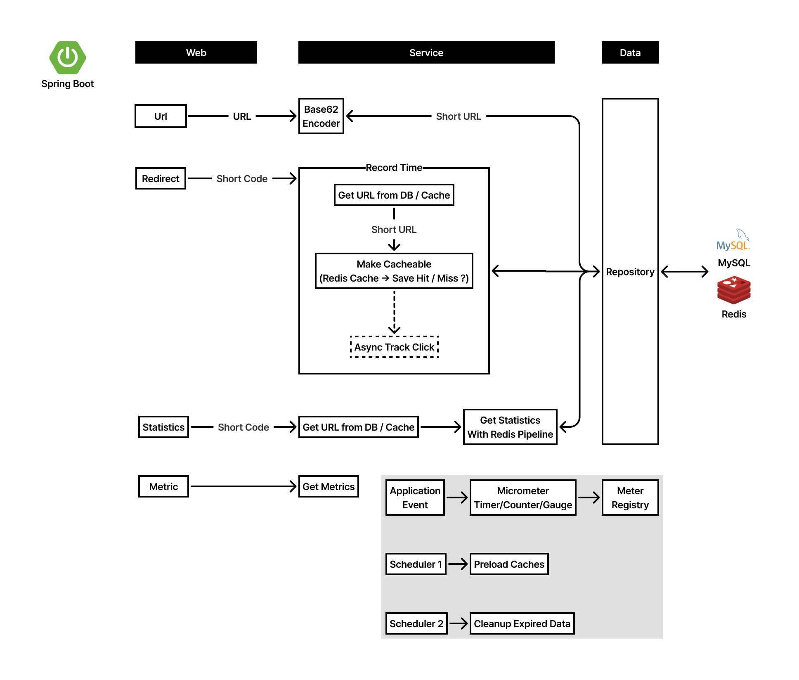
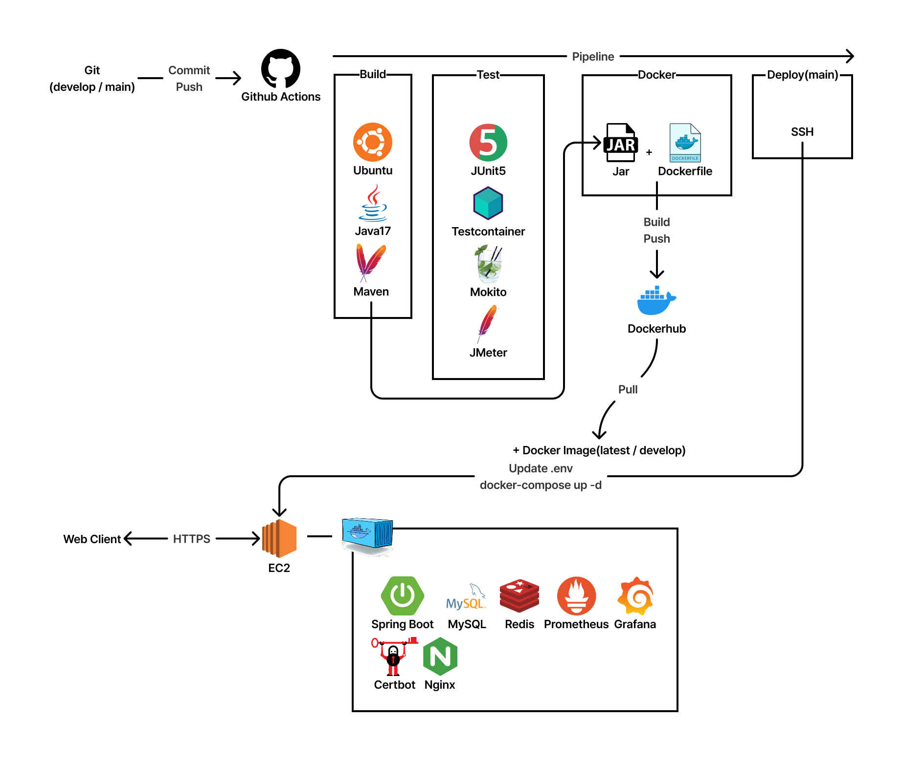

# 스냅링크

스냅링크는 긴 URL을 7자리 짧은 코드로 변환하고 빠른 리다이렉트를 제공하는 고성능 URL 단축 서비스입니다. Redis 캐싱, 데이터베이스 최적화, 비동기 처리를 통해 제한된 리소스 환경(AWS 프리티어)에서도 탁월한 성능을 발휘하도록 설계되었습니다.

## 목차

1. [프로젝트 핵심 성과](#프로젝트-핵심-성과)
2. [주요 기능](#주요-기능)
3. [기술 스택](#기술-스택)
4. [시스템 아키텍처](#시스템-아키텍처)
5. [기술적 도전과 해결 방법](#기술적-도전과-해결-방법)
6. [성능 테스트 및 분석](#성능-테스트-및-분석)
7. [성능 모니터링 지표](#성능-모니터링-지표)
8. [설치 및 실행 방법](#설치-및-실행-방법)
9. [API 문서](#api-문서)
10. [향후 개선 계획](#향후-개선-계획)
11. [라이선스](#라이선스)

## 프로젝트 핵심 성과

| 메트릭 | 최적화 전 | 최적화 후 | 개선율 | 비고 |
| --- | --- | --- | --- | --- |
| 리다이렉트 응답시간 | 46ms | 4ms | 91.3% 감소 | |
| TPS (초당 트랜잭션) | 771.9 | 1,003.5 | 30.0% 증가 | 리다이렉트 한정 |
| 데이터베이스 부하 | 100% | <10% | 90%+ 감소 | |
| 오류율 | 0.00492% | 0.00130% | 73.6% 감소 | |
| 캐시 히트율 | - | 99.94% | - | |

## 주요 기능

- URL 단축: 긴 URL을 Base62 인코딩을 사용하여 7자리 코드로 변환
- 커스텀 코드: 사용자 지정 단축 코드 지원
- 유효기간 설정: URL 만료일 설정 기능
- 클릭 통계: 단축 URL 사용 통계 추적 (브라우저별, 국가별, 일별)
- 성능 모니터링: Micrometer를 통한 메트릭 수집 및 API를 통한 성능 지표 조회

## 기술 스택

### Backend Framework
- Java 17
- Spring Boot 3.5.4
- Spring Data JPA, Spring Cache
- Spring Boot Actuator

### 데이터베이스 & 캐싱
- MySQL 8.0 (주 데이터 저장소)
- Redis 7.0 (캐싱 및 통계 데이터)
- HikariCP (커넥션 풀 최적화)

### 최적화 기법
- 다층 Redis 캐싱 (Spring Cache 추상화)
- 데이터베이스 인덱스 최적화
- 비동기 처리 (@Async)
- Redis Pipeline (명령어 일괄 처리)

### 테스팅 & 성능 측정
- JUnit 5 & Spring Boot Test
- Testcontainers (통합 테스트)
- Apache JMeter (부하 테스트)

### 배포 & 인프라
- Docker & Docker Compose
- GitHub Actions (CI/CD)
- AWS EC2 (t2.micro)

### 모니터링 & 로깅
- Micrometer (메트릭 수집)
- Spring Boot Actuator
- Logback

## 시스템 아키텍처

### 애플리케이션 아키텍처

스냅링크는 다음과 같은 계층으로 구성됩니다.

1. Web Layer: REST API 컨트롤러, 요청 검증, 예외 처리
2. Service Layer: 비즈니스 로직, 트랜잭션 관리, 캐싱 전략
3. Data Layer: 데이터베이스 접근, 영속성 관리



### 인프라 아키텍처

스냅링크는 자동화된 CI/CD 파이프라인과 컨테이너화된 배포 환경을 통해 안정적이고 확장 가능한 인프라를 구축했으며, 다음과 같은 요소로 구성되어 있습니다.

1. 애플리케이션 서버: Spring Boot 애플리케이션 (Docker 컨테이너)
2. 데이터베이스: MySQL (영구 저장소)
3. 캐시 서버: Redis (고성능 인메모리 캐싱)
4. 모니터링: Micrometer를 통한 메트릭 수집 및 API 엔드포인트 제공
5. CI/CD 파이프라인: GitHub Actions를 통한 자동화된 빌드, 테스트, 배포



## 기술적 도전과 해결 방법

### 1. 대용량 트래픽 처리와 응답 시간 최적화

도전 과제
- URL 단축 서비스의 핵심 기능인 리다이렉트 요청 처리 시 46ms의 높은 응답 시간과 데이터베이스 부하 집중 문제 발생
- 특히 읽기:쓰기 비율이 100:1에 달하는 워크로드 특성을 고려한 최적화 필요

해결 방법: Redis 다층 캐싱 전략

```java
@Configuration
@EnableCaching
public class CacheConfig extends CachingConfigurerSupport {
    @Bean
    public CacheManager cacheManager(RedisConnectionFactory connectionFactory,
                                     @Qualifier("redisObjectMapper") ObjectMapper mapper) {
        // 캐시별 설정
        Map<String, RedisCacheConfiguration> cacheConfigurations = new HashMap<>();
        cacheConfigurations.put("urls", defaultConfig.entryTtl(Duration.ofDays(1)));
        cacheConfigurations.put("stats", defaultConfig.entryTtl(Duration.ofMinutes(30)));

        return RedisCacheManager.builder(connectionFactory)
                .cacheDefaults(defaultConfig)
                .withInitialCacheConfigurations(cacheConfigurations)
                .build();
    }
}
```

```java
@Override
@Cacheable(value = "urls", key = "#shortCode", unless = "#result == null")
public Url getUrlByShortCode(String shortCode) {
    return urlRepository.findActiveByShortCode(shortCode)
            .orElseThrow(() -> UrlNotFoundException.EXCEPTION);
}
```

주요 구현 전략
1. Spring Cache 추상화 활용: 비즈니스 로직과 캐싱 로직 분리
2. 데이터 특성별 TTL 적용: URL(1일), 통계(30분)
3. 캐시 워밍업: 인기 URL 미리 로드하여 초기 캐시 히트율 향상
4. Write-Through 패턴: 데이터 변경 시 캐시와 DB 동시 업데이트
5. Redis Pipeline: 여러 Redis 명령을 단일 네트워크 왕복으로 처리

결과
- 리다이렉트 응답 시간: 46ms → 4ms (91.3% 감소)
- 캐시 히트율: 99.94% 달성
- 데이터베이스 부하: 90% 이상 감소

### 2. 데이터베이스 최적화

도전 과제: 캐시 미스 상황에서 데이터베이스 조회 성능 저하와 동시 접속자 증가 시 커넥션 부족 문제 발생

해결 방법: 인덱스 설계 및 커넥션 풀 튜닝

```java
@Entity
@Table(name = "urls", indexes = {
        @Index(name = "idx_url_short_code_expires", columnList = "shortCode, expiresAt"),
        @Index(name = "idx_url_expires_at", columnList = "expiresAt"),
        @Index(name = "idx_url_click_count", columnList = "clickCount")
})
public class Url {
    // 엔티티 필드
}
```

```yaml
spring:
  datasource:
    hikari:
      maximum-pool-size: 20              # 동시 연결 수 증가
      minimum-idle: 5                    # 최소 유지 연결 수
      idle-timeout: 300000               # 유휴 연결 제거 시간 (5분)
      max-lifetime: 1800000              # 최대 수명 (30분)
      connection-timeout: 20000          # 연결 타임아웃 (20초)
      connection-test-query: SELECT 1    # 연결 유효성 검사 쿼리
```

주요 구현 전략
1. 복합 인덱스 설계: 쿼리 패턴 분석 후 최적의 인덱스 구성
    - `(shortCode, expiresAt)` 인덱스: 유효한 URL 빠른 조회
    - `expiresAt` 인덱스: 만료된 URL 효율적 관리
    - `clickCount` 인덱스: 인기 URL 조회 최적화
2. HikariCP 커넥션 풀 튜닝: AWS 프리티어 환경에 최적화된 설정
3. 쿼리 최적화: Prepared Statement 활용으로 SQL 파싱 오버헤드 제거

결과
- 캐시 미스 시 조회 시간: 42.9% 감소
- 커넥션 부족 문제 해결
- 데이터베이스 부하 분산

### 3. 핵심 기능과 부가 기능 분리를 통한 성능 향상

도전 과제: URL 리다이렉트 과정에서 클릭 통계, 브라우저/국가별 데이터 수집 등 부가 기능이 응답 시간 지연 문제 야기

해결 방법: Spring의 @Async 활용한 비동기 처리

```java
@Service
@RequiredArgsConstructor
public class ClickTrackingService {
    private final RedisTemplate<String, Object> redisTemplate;
    private final UrlService urlService;

    @Async
    public void trackClick(String shortCode, String userAgent, String ipAddress) {
        // 기본 클릭 카운트 증가
        urlService.incrementClickCount(shortCode);

        // 일별 통계
        String dailyKey = "stats:daily:" + shortCode + ":" + LocalDate.now();
        redisTemplate.opsForValue().increment(dailyKey, 1);
        redisTemplate.expire(dailyKey, 30, TimeUnit.DAYS);

        // 브라우저 통계
        String browser = extractBrowser(userAgent);
        String browserKey = "stats:browser:" + shortCode;
        redisTemplate.opsForHash().increment(browserKey, browser, 1);
        
        // 국가별 통계
        String country = getCountryFromIp(ipAddress);
        String countryKey = "stats:country:" + shortCode;
        redisTemplate.opsForHash().increment(countryKey, country, 1);
    }
}
```

```java
@GetMapping("/{shortCode}")
public ResponseEntity<Void> redirectToOriginalUrl(@PathVariable String shortCode, HttpServletRequest request) {
    // 핵심 흐름: URL 조회 및 만료 확인
    Url url = metricsService.getUrlByShortCode(shortCode);
    if (url.getExpiresAt() != null && url.getExpiresAt().isBefore(LocalDateTime.now())) {
        throw UrlExpiredException.EXCEPTION;
    }
    
    // 부가 기능: 클릭 추적을 비동기로 처리
    clickTrackingService.trackClick(shortCode, request.getHeader("User-Agent"), getClientIp(request));

    // 핵심 흐름: 리다이렉트 응답 반환
    return ResponseEntity.status(HttpStatus.FOUND)
            .location(URI.create(url.getOriginalUrl()))
            .build();
}
```

주요 구현 전략
1. 핵심 흐름과 부가 기능 분리: 사용자 경험에 직접 영향을 주는 기능과 백그라운드 처리 기능 구분
2. @Async 어노테이션: Spring의 비동기 처리 기능 활용
3. @EnableAsync: 애플리케이션 메인 클래스에 비동기 기능 활성화

결과
- 리다이렉트 응답 시간 추가 감소
- 서버 처리량(TPS) 약 30% 증가
- AWS 프리티어 환경에서도 안정적인 성능 발휘

### 4. 종합적인 성능 모니터링 체계 구축

도전 과제: 성능 최적화 효과를 정확히 측정하고 시스템 성능을 실시간으로 모니터링할 수 있는 체계 필요

해결 방법: Micrometer를 통한 종합적인 메트릭 수집

```java
@Configuration
public class MetricsConfig {
    // 캐시 히트율 측정
    @PostConstruct
    public void setupCacheHitRatioGauge() {
        Gauge.builder("cache.hit.ratio", this, service -> calculateCacheHitRatio())
                .description("캐시 히트율")
                .register(meterRegistry);
    }

    // URL 리다이렉트 타이머
    @Bean
    public Timer urlRedirectTimer(MeterRegistry registry) {
        return Timer.builder("url.redirect.time")
                .description("URL 리다이렉트 응답 시간")
                .publishPercentiles(0.5, 0.95, 0.99)
                .publishPercentileHistogram()
                .minimumExpectedValue(Duration.ofMillis(1))
                .maximumExpectedValue(Duration.ofSeconds(2))
                .register(registry);
    }
}
```

```java
@Primary
public class MetricsUrlService implements UrlServiceInterface {
    // URL 리다이렉트 시간 측정
    public <T> T recordTime(String timerName, Supplier<T> operation) {
        return Timer.builder(timerName)
                .register(meterRegistry)
                .record(operation);
    }
}
```

주요 구현 전략
1. 세부 메트릭 수집: 캐시 히트율, 응답 시간, 오류율 등 주요 지표 측정
2. Spring Boot Actuator: 헬스체크 및 메트릭 엔드포인트 제공
3. API를 통한 메트릭 조회: `/api/v1/metrics` 엔드포인트를 통한 실시간 성능 지표 확인
4. AOP 활용: 데이터베이스 쿼리 실행 카운트 측정

결과
- 실시간 시스템 성능 모니터링 가능
- 성능 병목 지점 식별 및 최적화 방향 설정
- 사용자 경험 변화 추적

## 성능 테스트 및 분석

### 테스트 환경 및 조건

성능 테스트는 Apache JMeter를 사용하여 다음과 같은 조건에서 수행되었습니다.

- 하드웨어: i7-8700 CPU, 32GB RAM
- 데이터베이스: AWS RDS MariaDB (프리티어 환경)
    - 본 서비스는 MySQL 8.0 사용, 테스트는 비용 절약을 위해 MariaDB 활용
- 테스트 시나리오
    - URL 리다이렉트 테스트: 100 스레드, 10초 램프업, 100회 반복 (10,000 요청)
    - URL 생성 테스트: 20 스레드, 5초 램프업, 10회 반복 (200 요청)
    - 통계 조회 테스트: 10 스레드, 2초 램프업, 5회 반복 (50 요청)
    - 메트릭 조회 테스트: 5 스레드, 1초 램프업, 5회 반복 (25 요청)
    - 부하 테스트: 500 스레드, 60초 램프업, 120초 지속 (500 요청)
- 최적화 단계
    - 단계 1: 기본 구현 (캐싱 X, 튜닝 X)
    - 단계 2: Redis 캐싱 추가 (캐싱 O, 튜닝 X)
    - 단계 3: HikariCP 튜닝 (캐싱 O, 튜닝 O)
    - 단계 4: 인덱스 최적화 (최종)

### 리다이렉트 요청 (주요 사용 케이스)

| 최적화 단계 | 평균 응답시간 | 최대 응답시간 | TPS | 오류율 |
| --- | --- | --- | --- | --- |
| 캐싱 X, 튜닝 X | 46ms | 336ms | 771.9 | 0% |
| 캐싱 O, 튜닝 X | 8ms | 397ms | 1001.9 | 0% |
| 캐싱 O, 튜닝 O | 7ms | 383ms | 1001.0 | 0% |
| 최종 | 4ms | 407ms | 1003.5 | 0% |

<details>
<summary>각 API 엔드포인트별 성능 테스트 결과</summary>

#### URL 생성 API
| 최적화 단계 | 평균 응답시간 | 최대 응답시간 | 오류율 |
| --- | --- | --- | --- |
| 캐싱 X, 튜닝 X | 79ms | 552ms | 0.03% |
| 캐싱 O, 튜닝 X | 70ms | 754ms | 0.045% |
| 캐싱 O, 튜닝 O | 70ms | 597ms | 0.06% |
| 최종 | 57ms | 587ms | 0.04% |

#### URL 통계 조회 API
| 최적화 단계 | 평균 응답시간 | 최대 응답시간 | 오류율 |
| --- | --- | --- | --- |
| 캐싱 X, 튜닝 X | 69ms | 543ms | 0% |
| 캐싱 O, 튜닝 X | 83ms | 639ms | 0% |
| 캐싱 O, 튜닝 O | 76ms | 546ms | 0% |
| 최종 | 64ms | 537ms | 0% |

#### 메트릭 조회 API
| 최적화 단계 | 평균 응답시간 | 최대 응답시간 | 오류율 |
| --- | --- | --- | --- |
| 캐싱 X, 튜닝 X | 49ms | 320ms | 0% |
| 캐싱 O, 튜닝 X | 60ms | 391ms | 0% |
| 캐싱 O, 튜닝 O | 59ms | 351ms | 0% |
| 최종 | 63ms | 307ms | 0% |

#### 리다이렉트 부하 테스트
| 최적화 단계 | 평균 응답시간 | 최대 응답시간 | 오류율 |
| --- | --- | --- | --- |
| 캐싱 X, 튜닝 X | 17ms | 329ms | 0.094% |
| 캐싱 O, 튜닝 X | 5ms | 381ms | 0.028% |
| 캐싱 O, 튜닝 O | 5ms | 389ms | 0.02% |
| 최종 | 4ms | 393ms | 0.012% |

#### 전체 테스트 결과 (모든 API 엔드포인트)
| 최적화 단계 | 평균 응답시간 | 최대 응답시간 | 오류율 |
| --- | --- | --- | --- |
| 캐싱 X, 튜닝 X | 46ms | 552ms | 0.00492% |
| 캐싱 O, 튜닝 X | 10ms | 754ms | 0.00213% |
| 캐싱 O, 튜닝 O | 8ms | 597ms | 0.00204% |
| 최종 | 6ms | 587ms | 0.00130% |
</details>

## 성능 모니터링 지표

최종적으로 측정된 주요 성능 지표는 다음과 같습니다.

- 캐시 히트율: 99.94%
- 평균 응답 시간: 3.66ms
- 95% 응답 시간: 0.78ms
- 99% 응답 시간: 1.11ms
- TPS (초당 트랜잭션 수): 350
- 총 요청 수: 21,000
- 에러율: 0.00130%
- DB 쿼리 수: 43,972
- 활성 URL 수: 1,386

## 설치 및 실행 방법

```bash
# 저장소 클론
git clone https://github.com/tentenacy/snaplink.git
cd snaplink

# Docker Compose로 애플리케이션 실행
docker-compose -f ./docker/docker-compose.yml up -d
```

## API 문서

API 문서는 Swagger UI를 통해 제공됩니다. [여기](https://snlink.xyz/swagger-ui.html)에서 확인할 수 있습니다.

### 주요 API 엔드포인트

| 엔드포인트 | 메서드 | 설명 |
|-----------|-----|-----|
| /{shortCode} | GET | 단축 URL 리다이렉트 |
| /api/v1/shorten | POST | URL 단축 생성 |
| /api/v1/urls/{shortCode} | GET | URL 정보 조회 |
| /api/v1/stats/{shortCode} | GET | 클릭 통계 조회 |
| /api/v1/metrics | GET | 시스템 메트릭 조회 |

## 향후 개선 계획

1. 확장성 강화
    - Redis Cluster 도입으로 캐시 확장성 향상
    - 읽기 전용 DB 복제본 추가를 통한 부하 분산

2. 접근 빈도 기반 동적 TTL 조정
    - 인기 URL은 캐시 TTL 연장
    - 저사용 URL은 TTL 단축하여 메모리 효율화

3. 메시지 큐 도입
    - 비동기 작업의 안정성 강화 (RabbitMQ/Kafka)
    - 작업 재시도 메커니즘 구현

4. 기능 확장
    - 사용자 계정 시스템 도입
    - 고급 분석 대시보드

## 라이선스

MIT License
